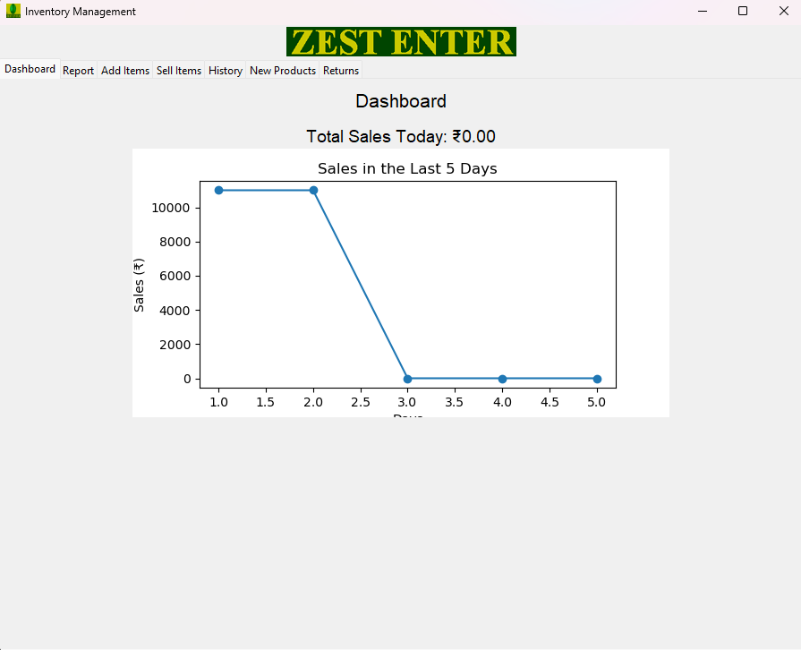

# Inventory-management-system
Inventory management for MSME's and small and medium enterprices

currently this invenotry mangagement system is created for <a href="https://maxmi4u.com/categories/8-by-8-backdrops">Zest Enterprices</a>

This is the application done with python for ui tkinter was used.
SQL for the database makes this accesable.
the looks as follows,

# Page 1 (Dashboard)
The Application starts with Dashboard Page where we can see total sales today and sales trend in past 5 days.

# Page 2 (New Items)
Here we add a new item that can be sold it has feilds like 
<li>Product Code</li>
<li>Product Name</li>
<li>MRP</li>
<li>Selling Price</li>

on pressing the add products button the product will be added to the database which can be accesed from add items page and sell items page
<b>Show all products</b> button allows to get a list of products that are being sold by the company.

